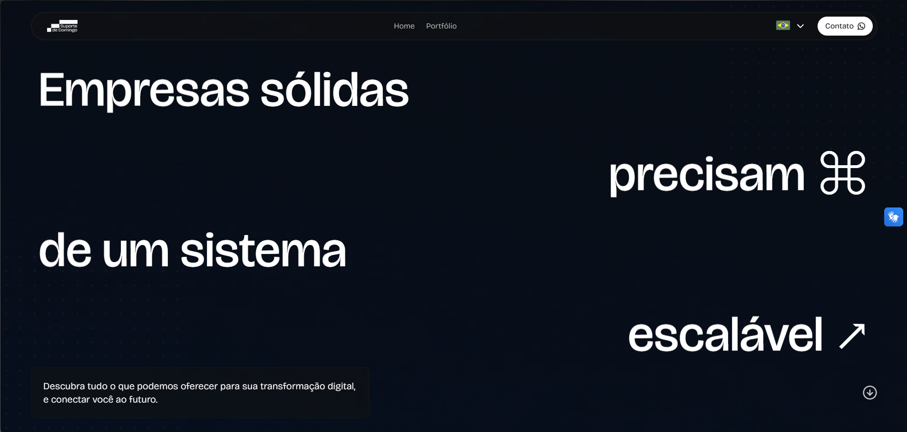

## 01. Overview & Desafio

A Suporte de Domingo (SdD) é um estúdio focado em criar soluções digitais que operam na interseção entre **design, engenharia de software e estratégia**. O desafio do projeto foi desenvolver a identidade visual da própria empresa e reorganizar a sua prateleira de serviços, fugindo da estética previsível das software houses tradicionais e do posicionamento genérico de agências de comunicação.

Em vez de vender serviços como produtos isolados, estruturamos toda a oferta comercial em um ecossistema integrado. Esse modelo permite que cada cliente inicie a parceria pelo ponto que melhor atende suas necessidades atuais e evolua a maturidade digital da sua operação ao longo do tempo.

[MEDIA: Mockup limpo da tela principal do site ou do hero com a frase "Empresas sólidas precisam de um sistema escalável", demonstrando a aplicação principal da marca em interface]

## 02. Sistema Visual & Brand Guidelines

A linguagem visual foi desenhada para conectar conceitos de interface, código e tipografia. A **Bricolage Grotesque** foi escolhida como fonte primária para conferir personalidade e presença marcante, enquanto a **Inter** resolve as aplicações funcionais e de dados. A paleta de cores se apoia no Royal Blue, Vista Blue e em uma escala de cinzas com variações em gradientes.

O sistema foi consolidado em um Brand Guidelines de 34 páginas, documentando a construção do logo, regras do símbolo, áreas de respiro, comportamento sobre mídias complexas e diretrizes de uso para produtos digitais reais.

[MEDIA: Mídia exibindo pranchas do Brand Guidelines, destacando a combinação das famílias tipográficas (Bricolage Grotesque + Inter) e a escala de cores com os tokens de gradiente]

## 03. O Ecossistema de Serviços

Para evitar apresentações comerciais baseadas em listas genéricas de entregáveis, organizamos a atuação da SdD dentro de uma **linha de evolução lógica**:

**Marca (Branding) → Presença (Landing Page) → Tecnologia (Software)**

As disciplinas de UI/UX e Mídias Sociais funcionam como camadas transversais acionadas conforme o contexto do projeto. Essa estrutura transformou a abordagem comercial em um processo consultivo de diagnóstico, onde o cliente consegue identificar o momento exato da sua empresa e entender qual deve ser o próximo passo técnico.

[MEDIA: Diagrama da arquitetura do ecossistema mostrando a progressão Marca → Presença → Tecnologia, ou captura de tela do deck comercial com o slide "Sua empresa está em qual etapa?"]

## 04. Aplicação no Produto & Resultados

O sistema visual e a lógica de ecossistema foram aplicados no site oficial e em todos os materiais institucionais do estúdio. As especificações dos serviços passaram a detalhar entregáveis concretos como repositórios de código, infraestrutura em nuvem, pipelines de CI/CD, design systems e manuais de marca.

A identidade deixou de ser um conjunto passivo de gráficos para se tornar o sistema que orienta a arquitetura de conteúdo do site, o tom das propostas e a organização estratégica de toda a operação.

[MEDIA: Composição de mockups das telas do site (desktop e mobile) mostrando a página de serviços, o grid de projetos e os componentes de interface em funcionamento]
