## 01. Introdução ao Atomic Design

### O que é?

O *Atomic Design* é uma metodologia de criação de sistemas de design (*Design Systems*) para o web design, criada por Brad Frost em 2013. Ela entende a criação de interfaces digitais do mesmo modo como a química compreende como toda matéria do universo é criada: tudo começa nos átomos.

Essa metodologia é dividida em 5 níveis, nos quais o primeiro é utilizado para criar o segundo, e assim por diante.

Níveis:

- Átomos
- Moléculas
- Organismos
- Templates
  - Eu chamo esses de "Wireframes" ou "Baixa Fidelidade" (*LoFi*).
- Páginas

#### Átomos

São os elementos mais básicos da interface, os quais são usados para, principalmente, construir outros elementos.

Exemplos:

- Botões (*textButton*)
- Textos ou *Labels*

#### Moléculas

São grupos de átomos juntos, que funcionam como um só na criação de organismos maiores.

Exemplos:

- Input de texto (*textInput*)
- Notificações *Toast*

#### Organismos

Junção das moléculas para criação de diferentes e mais complexas seções da interface.

Exemplos:

- Formulário completo (*form*)
- Cabeçalhos (*Header*)

#### Templates

Aqui, juntam-se organismos (sem preocupar-se com fidelidade ao design do elemento em si) para demonstrar a interface de uma forma mais visual, talvez para apresentar para um cliente ou para alguém que não tenha tanta familiaridade com Web Design.

Eu chamo de *Wireframes* ou *LoFi* porque a representação criada nessa etapa pode ser utilizada para definir como pretende-se montar a interface final, novamente sem preocupar-se com a fidelidade visual dos elementos apresentados.

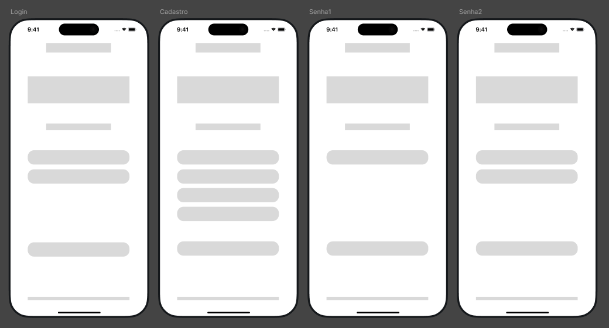

*Captura de tela do Figma da Code Trouble, demonstrando os templates.*

Aqui representado como um *template (LoFi)*, está a parte de autenticação do aplicativo.

A idealização de como deseja-se que a tela de login, cadastro e recuperação de senha fique no produto final, mas sem usar os componentes reais. Ou seja, sem se preocupar com a fidelidade aos componentes que serão usados — que é de onde vem o termo "baixa fidelidade" (ou "Low Fidelity — LoFi").

#### Páginas

As páginas são o produto final, o resultado idealizado no template. E aqui sim utiliza-se os componentes (sejam eles átomos, moléculas ou organismos) para constituir a interface final que o usuário entrará em contato.

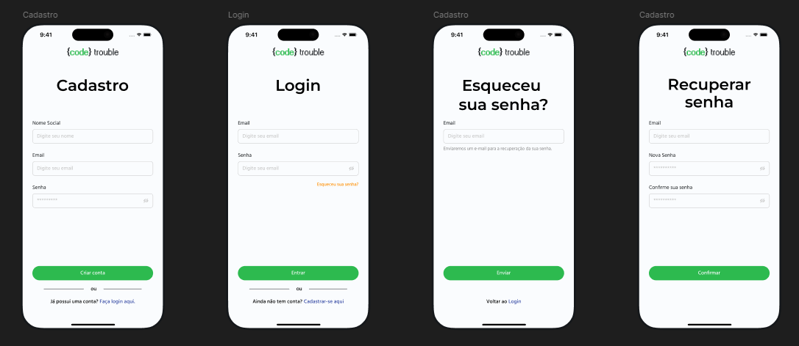

*Resultado final das telas da Code Trouble, com base nos wireframes.*

Aqui, representando as interfaces prontas, temos a parte de autenticação finalizada. E agora sim utilizando os componentes reais.

### Por que escolhi utilizar essa metodologia para esse projeto?

O querido Lucas Corrêa (meu mestre) me apresentou essa metodologia, e incentivado pelos benefícios e filosofia dela decidi começar a prototipação dos sistemas da Code Trouble por meio dos átomos, além de todo o desenvolvimento de marca (*branding*).

Antes mesmo de começar a criação em si das telas ou componentes do projeto, eu e Gabriel Balem (meu parceiro) criamos a base inicial da marca, definindo o que ela seria. Escolhemos a paleta de cores, tipografia, etc. Assim criando os primeiros átomos da Code Trouble.

Já no início da prototipação, decidi seguir a metodologia criando os componentes que imaginei que usaríamos para o projeto, tendo em mente os benefícios que isso traria mais para frente.

Listando alguns, temos:

1. **Consistência Visual**

   Criando os componentes com base no guia de estilo da marca, consegui alcançar uma consistência entre eles e entre toda a aplicação, seja ela web ou mobile.

2. **Facilidade de Manutenção**

   Utilizando a ferramenta de componentização do Figma, consigo atualizar apenas em um lugar alguma mudança necessária, e automaticamente todas as "cópias" desse componente (espalhadas pelas dezenas de telas) também são atualizadas instantaneamente.

3. **Escalabilidade**

   Conforme o projeto foi crescendo, consegui adicionar mais componentes sem precisar redefinir a estrutura visual de nenhum outro feito anteriormente. Além da possibilidade de reutilização de outros átomos ou moléculas já existentes.

   > Inclusive, essa capacidade de reutilizar componentes indica uma boa prática no Web Design moderno.

Resumindo, essa metodologia supriu as necessidades que esse projeto exigia, como escalabilidade. E também atendeu a minha ideia de como eu queria desenvolvê-lo, de um jeito prático e eficiente.

---

## 02. Os 3 primeiros níveis do Atomic Design na Code Trouble

Agora que já expliquei o que é e por que utilizei essa metodologia, quero apresentar alguns dos componentes criados e como eles se encaixam nesse modelo. Principalmente para demonstrar visualmente o processo de criação e reutilização dos componentes.

Para demonstrar de um jeito visual, vou utilizar o componente *Header*, que é um organismo composto de moléculas e átomos.

### *Breakdown* do componente *Header*

#### Organismo completo

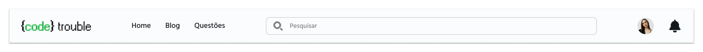

*Componente Header, organismo.*

O Header é composto por alguns átomos e algumas moléculas.

#### Moléculas

*Moléculas do componente Header.*

As moléculas do Header são:

- Barra de Navegação (*nav*)
  - 3 átomos dentro (links)
- Barra de Pesquisa (*searchBar*)
  - 2 átomos dentro (ícone de lupa e texto placeholder)

#### Átomos

*Átomos do componente Header.*

Os átomos do Header são:

- Logo
- Links (nav)
- Ícone de Lupa (searchBar)
- Texto Placeholder (searchBar)
- Avatar
- Ícone de Notificação

### Outros componentes da Code Trouble e seus níveis

Lista de mais alguns componentes feitos para a Code Trouble e onde eles se classificam dentro da metodologia.

#### Átomos

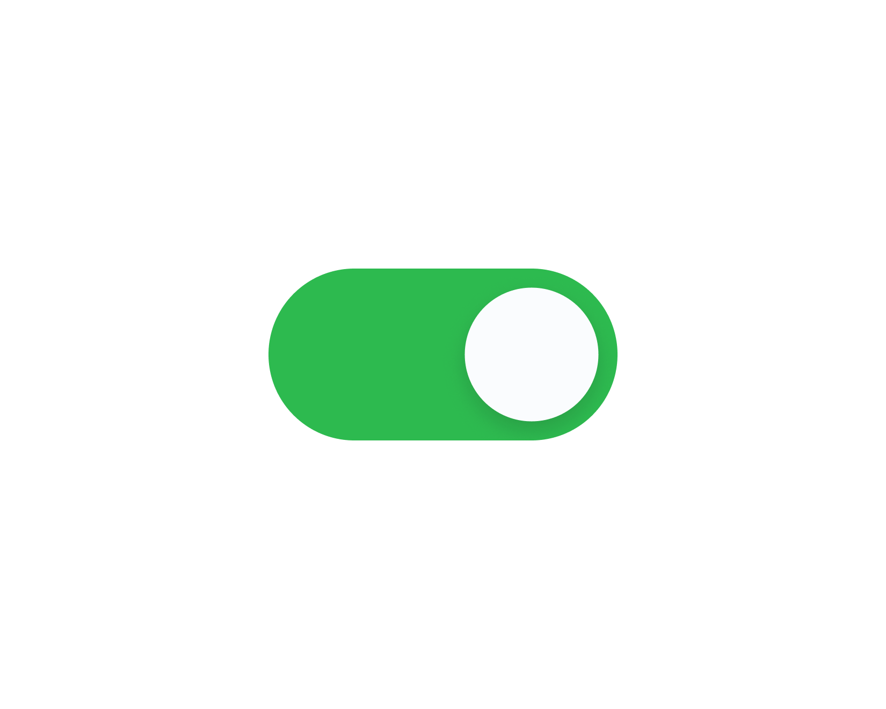

*Componente toggleButton, átomo.*

O componente toggleButton é apenas um átomo, pois não é composto de nada além de elementos gráficos.

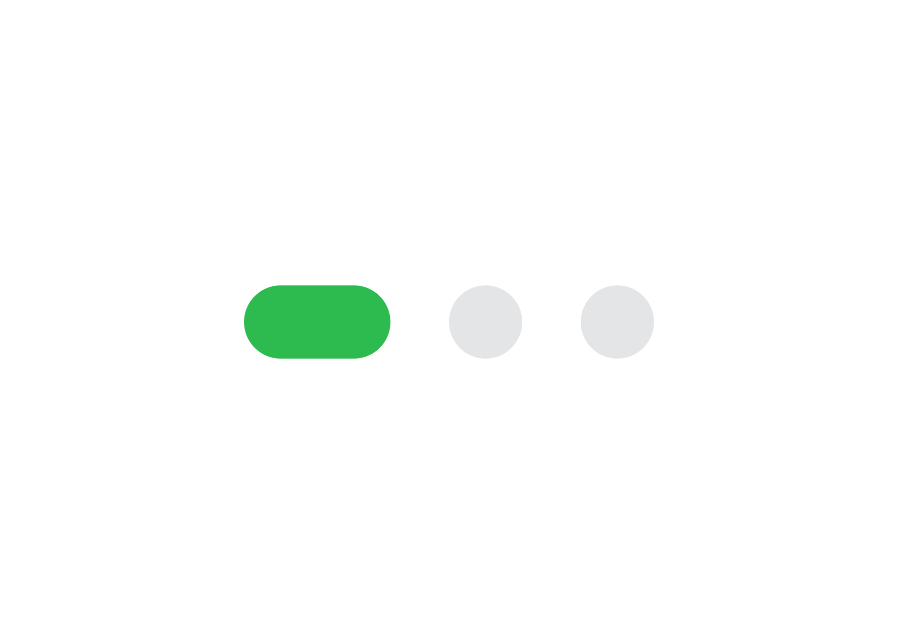

*Componente pageControl, átomo.*

O componente pageControl também é apenas um átomo.

#### Molécula

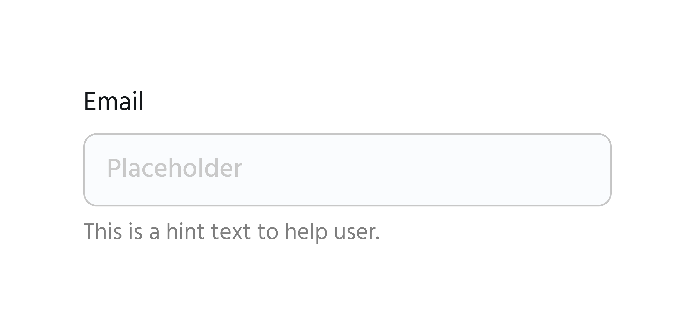

*Componente textInput, molécula.*

O componente textInput é uma molécula, pois é composto de alguns átomos, sendo eles:

- Descrição do Campo (label)
- Texto Placeholder
- Dica ao usuário (hintText)

#### Organismo

*Componente cookies, organismo.*

O componente cookies é formado por moléculas e átomos, assim classificando-se como um organismo:

- Link (molécula)
  - Texto
  - Ícone de Seta
- Botão de ação (átomo)
- Textos:
  - Título (átomo)
  - Parágrafo (átomo)

---

## 03. Criação dos Componentes

Para a criação dos componentes utilizados na Code Trouble, utilizei a ferramenta do Figma de componentização, que facilita a manutenção. Essa ferramenta também permite a criação de componentes com propriedades diferentes dentro de um só grupo — ou seja, o mesmo componente pode ter diferentes propriedades atreladas a ele, como cores, tamanhos, etc.

#### Componente Tags (ou Chips)

Nesse exemplo o componente recebe 3 propriedades, cada uma com alguns valores atrelados. Os valores podem ser booleanos (true ou false), estados do componente, tamanho, etc.

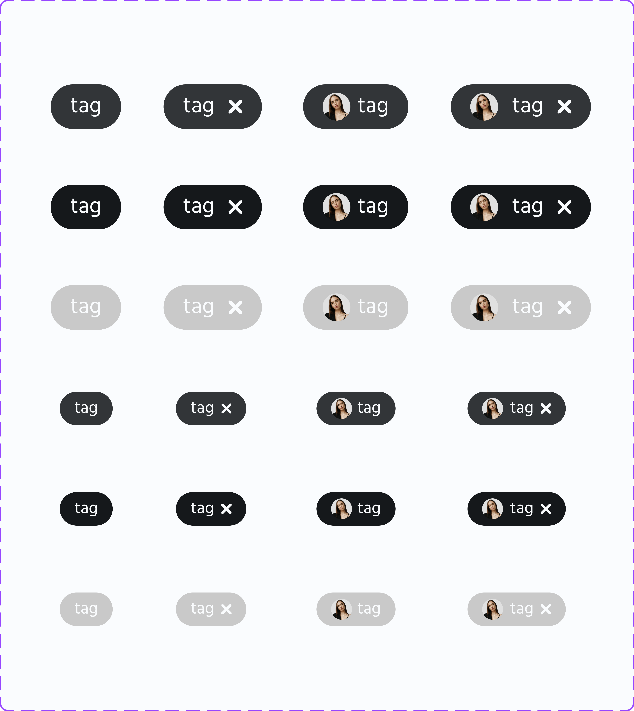

Propriedades desse componente e seus valores:

- State:
  - Enabled
  - Hover
  - Disabled
- Icon (true ou false)
- Avatar (true ou false)
- Size
  - Small
  - Large

### Aplicação da identidade visual da Code Trouble nos componentes

Para a criação de todos os componentes, sempre precisei levar em consideração a identidade visual da Code Trouble. Assim, utilizando as fontes escolhidas para o projeto e fazendo variações dos componentes de acordo com as cores da marca.

Por exemplo, ao criar um simples botão, é necessário criar variações utilizando as cores da marca (nesse caso, verde, laranja, azul e preto) e com as cores semânticas (perigo — vermelho, aviso — amarelo, sucesso — verde, informação — azul), além de também pensar nas variações de tamanhos, estados e formato desses botões.

### Processo de documentação e criação das variações dos componentes

Para o desenvolvimento das variações dos componentes, além da identidade visual, preciso considerar a interação do usuário final com tal elemento. Sendo assim, preciso deixar explícito para o time de desenvolvimento como o componente se comportará com certas interações, as mais comuns sendo o *Hover* (efeito ao passar o mouse), *Active* (quando o usuário interage) e o *Disabled* (quando o usuário não pode interagir com o componente).

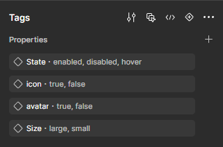

No caso das tags mencionadas anteriormente, deixei explícito como elas se comportarão quando os usuários interagirem com elas.

Felizmente o Figma deixa exposto quais propriedades os componentes têm, e quais são seus respectivos valores, facilitando o uso dos componentes no design e o entendimento dos comportamentos para os programadores.

---

## 04. Desenvolvimento da Identidade Visual da Code Trouble e Guia de Estilo

Após a criação da logo da Code Trouble, começamos o desenvolvimento da paleta de cores, tipografia e iconografia para a marca. Sempre com o objetivo principal do projeto em mente, passado pelo nosso chefe.

### Logo da Code Trouble

Após o escopo do projeto ser definido, começamos desenvolvendo a logo da Code Trouble. Pensando na estética de códigos e pixels, tentamos mesclar elementos que remetem à programação, como parênteses, colchetes ou, o que decidimos, chaves. Já a parte pixelizada foi aplicada direto no texto da logo, utilizando a fonte do Windows 95, a MS Sans Serif.

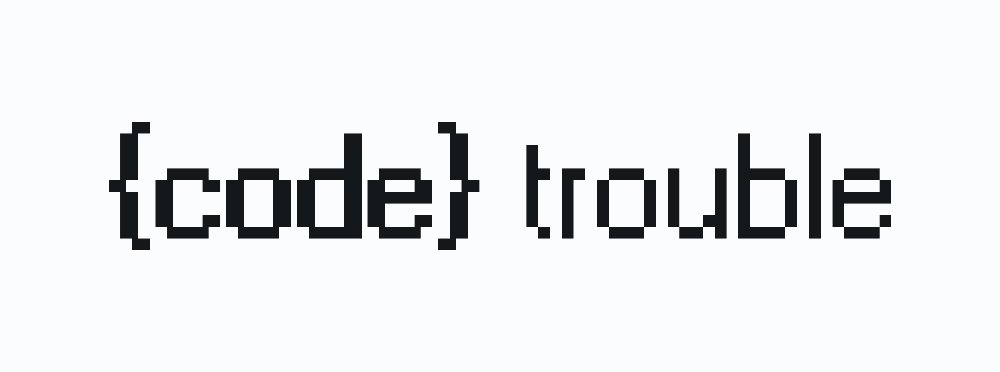

*Logo Code Trouble, completo e preto.*

Após decidirmos que usaríamos essa logo e após definirmos as cores, começamos a testar como implementar as cores principais da marca na logo.

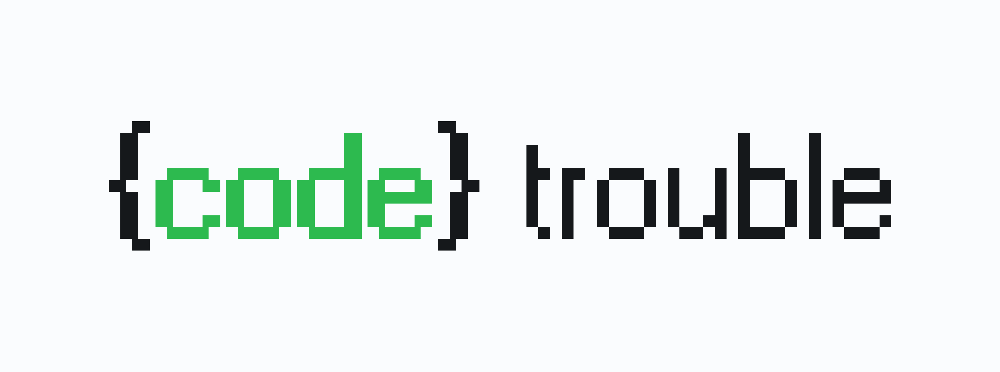

*Logo Code Trouble, completo e verde.*

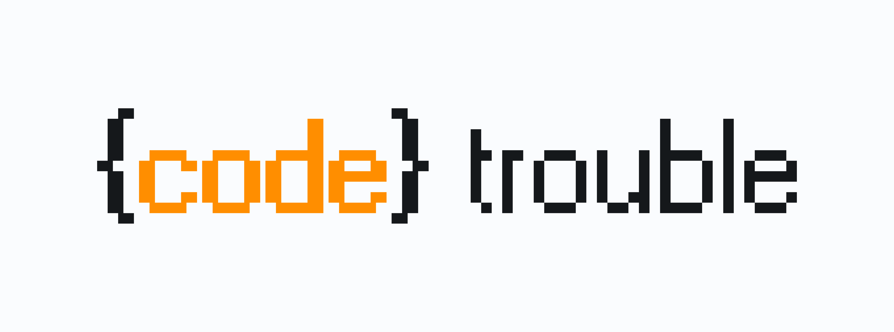

*Logo Code Trouble, completo e laranja.*

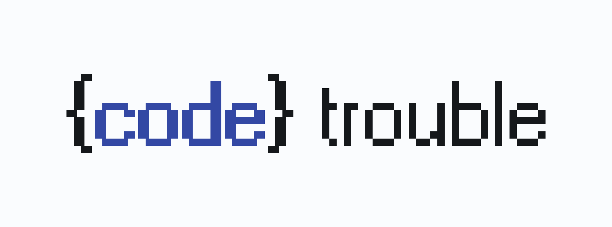

*Logo Code Trouble, completo e azul.*

Além da logo principal, também foi necessário desenvolver um símbolo mais compacto, já que a logo principal é bem mais longa que alta e não caberia em alguns lugares específicos. Como já tínhamos definido todas as cores e as logos coloridas, já fizemos essas versões compactas com cores, além de uma totalmente preta.

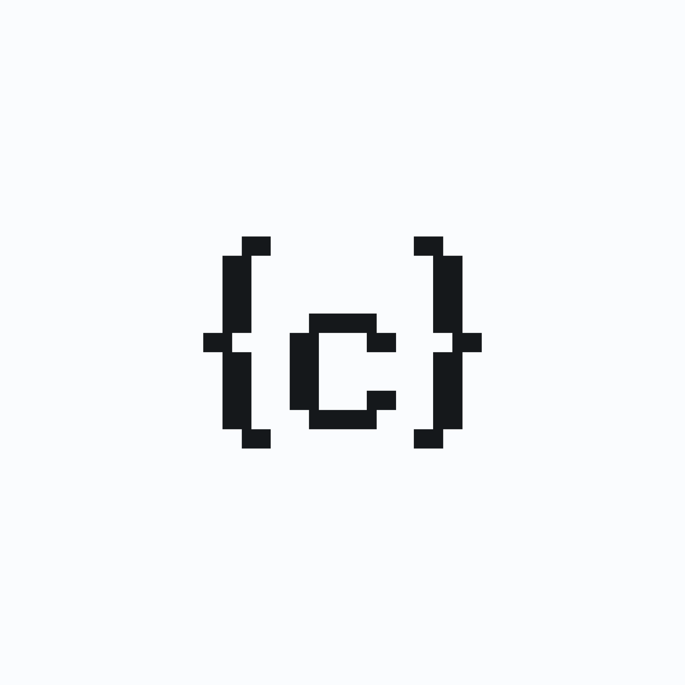

*Logo compacta preta.*

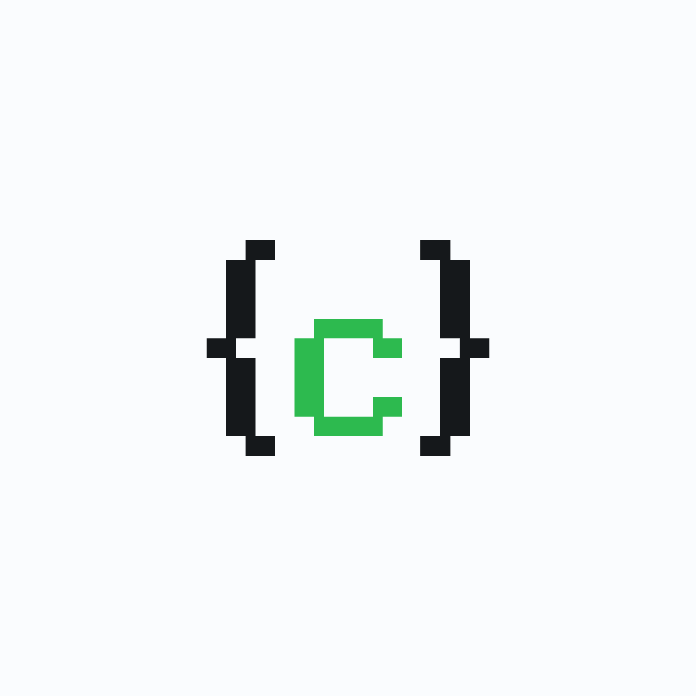

*Logo compacta azul.*

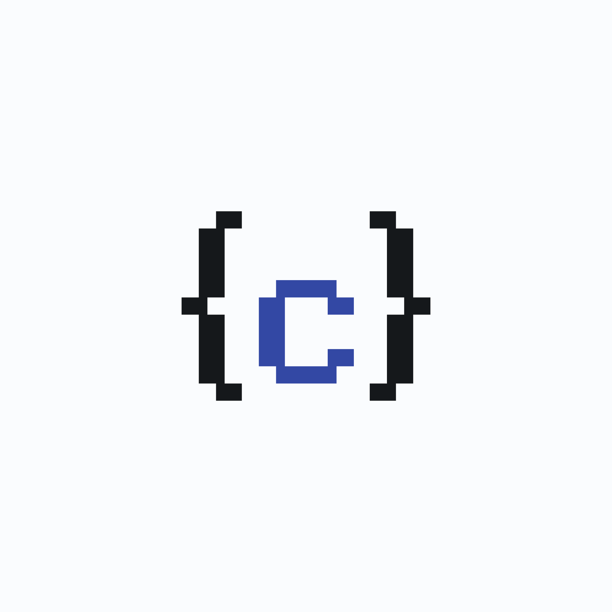

*Logo compacta verde.*

*Logo compacta laranja.*

### Paleta de Cores da Marca

Além da logo, começamos todo o processo de branding pela paleta de cores, utilizando diversas ferramentas de criação de paleta e consultando referências no livro *Psicologia das Cores*, da escritora alemã Eva Heller.

Lista de algumas das ferramentas que usamos para a criação da paleta (além do Figma, onde o utilizamos como uma lousa para testar e comparar as cores):

- **Coolors** — utilizado para testar como as cores se comportariam em conjunto. [coolors.co](https://coolors.co)
- **Adobe Color** — usamos para testar a acessibilidade e o contraste das cores para pessoas daltônicas. [color.adobe.com/create/color-accessibility](https://color.adobe.com/create/color-accessibility)
- **Paletton** — usamos para coletar e testar cores complementares, além de alguns dos gradientes. [paletton.com](https://paletton.com/#uid=10v0X0kzQM6+hQMZ+MlkbuNhHCU)
- **Realtime Colors** — finalizamos com esse, para testar como as cores escolhidas se apresentariam em um website. Perfeito para web designers. [realtimecolors.com](https://www.realtimecolors.com/?colors=050315-fbfbfe-2f27ce-dedcff-433bff&fonts=Inter-Inter)

Então chegamos no nosso resultado, finalizando com essa paleta:

*Paleta de cores da Code Trouble.*

#### Escala de Cinza

Junto das cores principais, também desenvolvemos uma mini paleta dentro da escala de cinza. Essas cores servem como um "suporte" para o desenvolvimento dos componentes, das telas e protótipos — especialmente úteis para bordas (*strokes*), divisores de seções (*dividers*) e até variações de fonte, permitindo mexer não só no tamanho e peso da fonte, mas também na cor.

Reutilizando o "preto" e o "branco" da paleta principal, escolhemos mais 3 cores entre eles para usar. Finalizando com esses tons:

*Paleta de cinzas da Code Trouble.*

#### Gradientes das Cores Principais

Após escolhermos as três cores principais, pegamos variações de tons e luminosidade delas, fazendo três outras "paletas secundárias", também utilizadas como apoio para suas respectivas cores, como em bordas ou cor de fundo de alguns componentes (*background-color*).

As cores representadas como um círculo correspondem à paleta principal da Code Trouble, com tons mais claros à esquerda e mais escuros à direita.

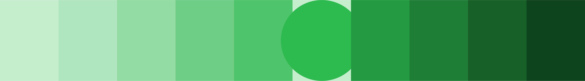

*Paleta de gradientes: Dark Pastel Green.*

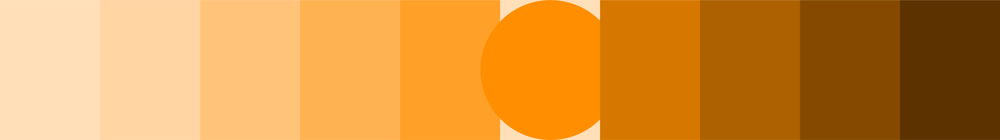

*Paleta de gradientes: Channel Orange.*

*Paleta de gradientes: Violet Blue.*

### Paleta de Cores Semânticas

Além das cores principais, seus gradientes e a escala de cinza, foi necessário escolher mais quatro cores para implementar na experiência do usuário (*UX*), cada uma respectiva a um *feedback* que o usuário receberá. Junto dessas quatro cores, também precisamos escolher outras duas cores de tons próximos para cada cor principal, utilizadas como apoio à sua cor respectiva.

#### Perigo — Vermelho

Usada para *feedback* de erros ou quando o usuário pode fazer uma ação irreversível, como excluir a própria conta.

*Vermelho principal, para o fundo (background) e para destaque, respectivamente.*

#### Informação — Azul

Usada para *feedback* referente a informações, como uma dica para o usuário.

*Azul principal, para o fundo (background) e para destaque, respectivamente.*

#### Sucesso — Verde

Usada para *feedback* referente a ações que foram concluídas com sucesso, finalizadas da maneira certa.

*Verde principal, para o fundo (background) e para destaque, respectivamente.*

#### Avisos — Amarelo

Usada para *feedback* de aviso, para informar ao usuário que algo deu errado, mas que não é tão sério quanto o perigo (vermelho).

*Amarelo principal, para o fundo (background) e para destaque, respectivamente.*

### Tipografia

Para a tipografia escolhemos três fontes diferentes: uma para títulos, uma para subtítulos e a última para todos os textos, textos de botões, links, etc.

No processo de escolha, levamos como requisito que fossem fontes simples, que combinassem, e o mais importante: que tivessem diversos estilos dentro da mesma fonte, ou seja, que fossem variáveis (indo do Light ou Extra Light até o Bold ou Black).

Fontes escolhidas:

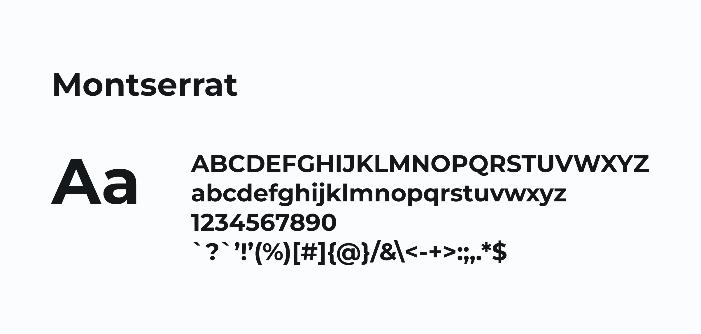

*Títulos — Montserrat.*

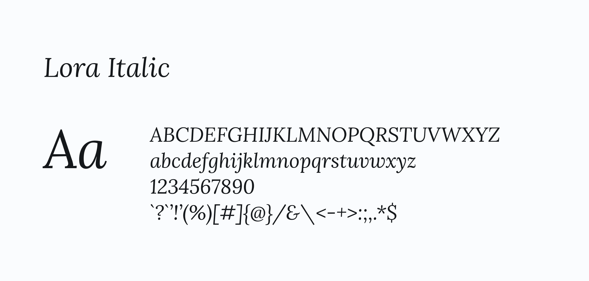

*Subtítulos — Lora Italic.*

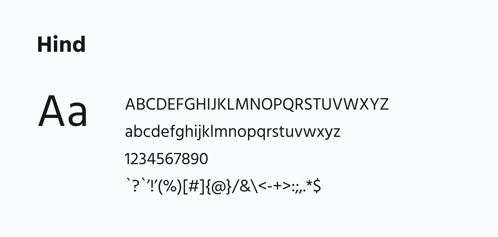

*Textos — Hind.*

Para decidir quais fontes utilizaríamos, usamos dois tipos de ferramentas: sites para procurar e baixar fontes, e sites para testar o pareamento das fontes — como elas ficam esteticamente juntas (além de ir testando no Figma).

Sites para achar e baixar fontes:

- **Google Fonts** — [fonts.google.com](https://fonts.google.com/)
- **Font.Download** — [font.download](https://font.download/)

> Recomendo sempre checar o licenciamento das fontes quando for utilizá-las para empresas/projetos reais, pois existem algumas com direitos autorais.

Sites para testar as fontes:

- **Font Pairing** — [fontjoy.com](https://fontjoy.com/)

### Iconografia

Os ícones desse projeto carregaram quase toda a estética "pixelizada" que estávamos procurando. Utilizamos ícones disponibilizados pela comunidade do Figma.

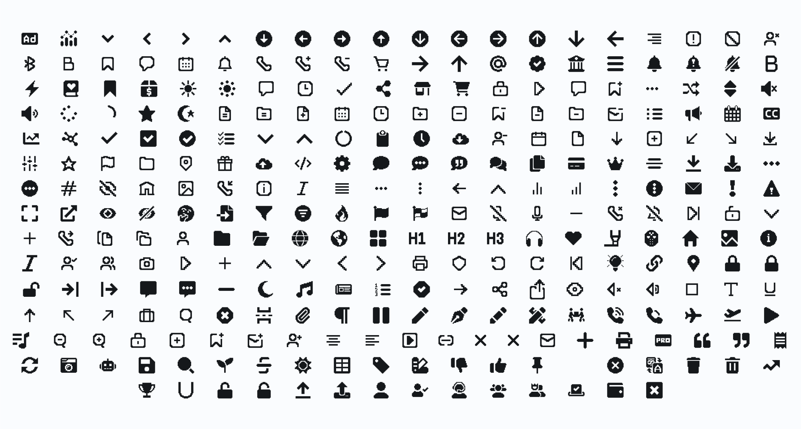

*Ícones pixelizados — comunidade do Figma.*

### Criação do guia de estilo

Para finalizar a criação da identidade visual, juntamos todos esses pontos mencionados anteriormente em um só lugar, o qual chamamos de guia de estilo (*Style Guide*). Nesse guia apresentamos, de uma forma visual, os detalhes referentes à marca — sem ser necessariamente um Guia de Marca completo (*Brand Guidelines*).

*Guia de estilo da Code Trouble.*

---

## 05. Ferramentas Utilizadas

Além dos sites que usamos para a criação e teste dos estilos da marca, todo o projeto foi desenvolvido no Figma. Esse programa permitiu a manipulação das cores e das fontes para testes, e principalmente o desenvolvimento dos componentes e telas para finalização do projeto. Após a finalização, lançamos o projeto na comunidade do Figma: [figma.com/community/file/1443024997825768386/code-trouble](https://www.figma.com/community/file/1443024997825768386/code-trouble)

### Software utilizado

[figma.com](https://www.figma.com)

### Figma Flow

Além de toda a prototipação e componentização que o Figma permite, também foi utilizado o Figma Flow para testar animações dos componentes e das transições entre telas. Esse flow também demonstra como seria a navegação do usuário no site ou aplicativo.

---

## 06. Resultados e Impactos da Utilização do Atomic Design

### Conclusão Geral e Aprendizados para o Futuro

Esse artigo é a documentação do uso da metodologia Atomic Design aplicada na criação da Code Trouble. Ao utilizar essa abordagem no projeto, conseguimos garantir a consistência visual desejada e a escalabilidade para possíveis adições ao sistema.

Ao longo do desenvolvimento do projeto, aprendemos sobre a organização e o planejamento que o Atomic Design exige, e como esse método oferece um retorno gigantesco na eficiência e clareza no processo de prototipação. Essa metodologia não apenas atendeu às necessidades propostas, mas também estabeleceu uma base sólida e uma referência consistente para futuros projetos.

---

## 07. Referências

- **Atomic Design**, por Brad Frost — [bradfrost.com/blog/post/atomic-web-design](https://bradfrost.com/blog/post/atomic-web-design/)
- **Atomic Design**, no Medium, por Jessica Araujo — [medium.com/pretux/atomic-design](https://medium.com/pretux/atomic-design-o-que-é-como-surgiu-e-sua-importância-para-a-criação-do-design-system-e3ac7b5aca2c)
- ***Psicologia das Cores***, livro de Eva Heller